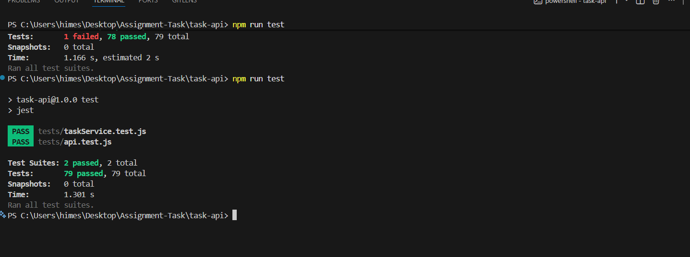
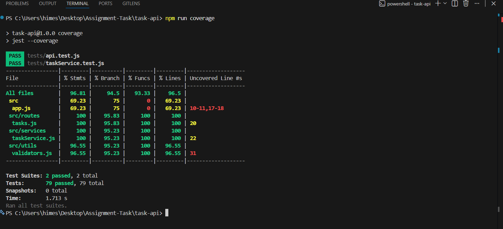

# Task Manager API – Take-Home Assignment

## Overview

This repository contains my solution for the Task Manager API take-home assignment.

The objective of the assignment was to understand an unfamiliar codebase, write automated tests, identify bugs, fix one bug, and implement a new feature while maintaining good code quality.

---

# Completed Tasks

## Unit Tests

Added comprehensive unit tests for `taskService.js`, covering:

* Task creation
* Task retrieval
* Find by ID
* Status filtering
* Pagination
* Statistics
* Task updates
* Task deletion
* Task completion
* Task assignment
* Reset functionality

---

## Integration Tests

Added API integration tests using **Jest** and **Supertest** covering:

* POST `/tasks`
* GET `/tasks`
* GET `/tasks?status=`
* GET `/tasks?page=&limit=`
* PUT `/tasks/:id`
* DELETE `/tasks/:id`
* PATCH `/tasks/:id/complete`
* PATCH `/tasks/:id/assign`
* GET `/tasks/stats`

Each endpoint includes both happy-path and edge-case scenarios.

---

##  Bug Investigation

During testing, multiple issues were identified and documented in **BUG_REPORT.md**.

The report includes:

* Expected behavior
* Actual behavior
* How each issue was discovered
* Suggested fix
* Fix status

---

##  Bug Fixed

Fixed identified issues in the application and updated the corresponding tests to verify the corrected behavior.

---

##  New Feature Added

Implemented the required endpoint:

```http
PATCH /tasks/:id/assign
```

### Request Body

```json
{
  "assignee": "Alice"
}
```

### Behavior

* Assigns a user to a task
* Allows reassignment
* Returns the updated task
* Returns **404** if the task does not exist
* Validates missing, empty, whitespace-only, and invalid assignee values

---

# Test Coverage

The project includes:

* Unit tests
* Integration tests
* Validation tests
* Edge-case tests
* Regression tests for discovered bugs

Coverage summary:

```text
Paste your coverage summary here.

Example:

Test Suites: 2 passed
Tests: 79 passed

Statements : 96.81%
Branches   : 94.5%
Functions  : 93.33%
Lines       : 95.6%
```

---

## Test Results

### All Tests Passing



### Test Coverage




# Project Structure

```text
task-api/
│
├── src/
├── tests/
├── screenshots/
│   ├── coverage.png
│   └── tests-passed.png
├── BUG_REPORT.md
├── README.md
├── package.json
└── .gitignore
```

---

# Assumptions

* Pagination is 1-indexed.
* Tasks can be reassigned.
* Statistics are computed dynamically.
* The application uses an in-memory data store for simplicity.

---

# Additional Documentation

* **BUG_REPORT.md** – Details of the bugs identified during testing and their resolutions.

---

# Future Improvements

Given additional time, I would focus on:

* Authentication and authorization
* Persistent database storage
* Concurrency testing
* Performance and load testing
* Security-focused validation
* API documentation (OpenAPI/Swagger)
* CI/CD integration with automated test execution

---

# Author

**Himesh**

Take-Home Assignment Submission – 2026

